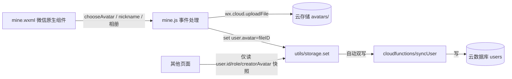

## 用户需求概述

重构小程序用户信息体系：将原本「从本地目录图片（/images/touxiang/*.png）选择头像 + 手填昵称」的方式，改为默认获取微信用户名与微信头像，同时保留用户自定义修改能力，并将头像持久化到云开发云存储（cloud://fileID）。

## 核心功能

- 注册/编辑默认走微信原生能力：`button open-type="chooseAvatar"` 一键选取微信头像，`input type="nickname"` 一键填充微信昵称
- 支持用户修改：可重新选择微信头像、或从手机相册上传自定义头像，昵称可自由编辑
- 头像上传后写入云存储得到 cloud://fileID 持久保存，并随用户资料双写到云数据库 users 集合
- 兼容性：已注册用户的旧本地路径头像仍可正常显示，编辑时未重新选择则保留原值，无需数据迁移
- 关联页面排查：确认 active / history / my-matches / create-match / edit-groups / match-record / match-detail 仅使用 user.id / role / creatorId 或比赛内 creatorAvatar 快照，不受本次头像来源变更影响

## 视觉与交互效果

- 个人中心页（mine）注册区与编辑弹窗的头像选择由「网格选图」变为「圆形头像预览 + 微信头像按钮 + 相册上传按钮」的极简交互
- 昵称输入变为微信昵称快捷填充输入框，点击即带出微信昵称
- 整体延续品牌橙金渐变（#FF6B35 → #F59E0B）与圆角卡片风格

## 技术栈选择

- 前端：微信小程序原生（WXML / WXSS / JS），框架属性 Miniprogram
- 云能力：微信云开发（云存储 `wx.cloud.uploadFile` 上传头像获取 cloud://fileID；云数据库 `users` 集合已通过 `syncUser`/`getUserFromCloud` 就绪）
- 复用既有：utils/storage.js 的 `set('user')` 自动双写云端机制、cloudfunctions/syncUser、cloudfunctions/getUserFromCloud、utils/sync-helper.js 的 `syncUserFromCloud()`
- 组件库：沿用项目既有 vant-weapp（create-match 等页面已用），新增按钮/输入以原生 WXSS 实现，风格与现有橙金主题一致

## 实现方案

### 总体策略

在不改变现有分层架构（页面层 → utils/storage → 云函数/云存储）的前提下，集中改造「用户信息编辑唯一入口」`pages/mine`，将头像数据从「本地图片路径」升级为「云存储 fileID」。其他页面只消费 `user.id`/`role` 或比赛内 `creatorAvatar` 快照，天然兼容，无需改动。

### 关键技术决策

1. **微信平台限制应对**：真实微信昵称/头像无法静默获取，必须由用户手势触发。`chooseAvatar` 返回临时文件 `wxfile://tmp_...`，`input type="nickname"` 经 `bindnickname` 返回 `event.detail.nickname`。两者均为官方推荐原生方案，无需额外授权弹窗。
2. **头像持久化**：`chooseAvatar`/相册返回的临时路径非持久，必须 `wx.cloud.uploadFile` 上传到云存储得到 `cloud://fileID` 再入库。cloudPath 采用 `avatars/{openid}_{timestamp}.png` 唯一命名，避免覆盖与冲突。
3. **存储兼容**：`user.avatar` 字段由「本地路径」拓展为「本地路径 | cloud://fileID | https 临时地址」三态，`<image src>` 对三者均原生支持，旧用户零迁移。
4. **后端零改动**：`syncUser` 已把 `avatar` 按字符串写入；`getUserFromCloud` 按 openid 读取；`syncUserFromCloud` 合并逻辑均对 fileID 透明，无需改云函数。
5. **转发图兼容**：`app.js` 的 `globalData.shareAvatar` 直接用于 `onShareAppMessage.imageUrl`，但 cloud://fileID 不能作为分享图。需在 `loadUserForShare` 中对 cloud:// 前缀调用 `wx.cloud.getTempFileURL` 转换为 https 临时地址后缓存。

### 性能与可靠性

- 上传为单次小文件（头像约数十 KB），`wx.cloud.uploadFile` 走云开发通道，耗时低；加载阶段做一次 `getTempFileURL` 异步换取并缓存，分享时直接复用，避免每次分享重复请求。
- 移除不再使用的 `avatarList`（约 30 项本地路径数组）及 `selectAvatar`/`selectEditAvatar` 逻辑，消除死代码，减小包体。
- 上传失败需 fallback：chooseAvatar 拿到的本地临时路径可作为兜底直接存为 avatar，保证注册/编辑流程不中断；相册上传失败则提示重试，不破坏既有资料。

## 实现要点（执行细节）

- 复用 `storage.set('user', ...)` 自动双写，新增头像仅需在 set 前把 fileID 写入 user.avatar，其余同步链路自动生效。
- 注册 `register()` 与编辑 `saveUserInfo()` 中，输入源从 `inputAvatar`（本地路径）改为 `inputAvatar`（fileID 或临时路径兜底）；昵称从 `onNameInput` 改为同时支持 `bindnickname` 填充。
- 已注册用户进入编辑弹窗时，预览区 `wx:if="{{user.avatar}}"` 对本地路径与 fileID 均生效，无需分支判断。
- 注意 `mine.wxml` 中 `avatar-grid` 循环两处（注册区第 24 行、编辑弹窗第 121 行）需整体替换为按钮式交互。

## 架构设计

维持现有分层，仅替换数据取值方式与渲染组件：



关联页面无依赖改动，箭头表示它们继续从 storage 读取，与头像来源解耦。

## 目录结构与改动文件

```
d:\AI\nanbowan-miniprogram\
├── utils/
│   └── storage.js              # [MODIFY] 新增 uploadAvatarToCloud(tempFilePath) 云存储上传工具，返回 cloud://fileID
├── pages/mine/
│   ├── mine.js                 # [MODIFY] 移除 avatarList/selectAvatar/selectEditAvatar；新增 onChooseAvatar、onNickname、chooseFromAlbum；register/saveUserInfo 改用 fileID
│   ├── mine.wxml               # [MODIFY] 注册区与编辑弹窗移除 avatar-grid，改用 chooseAvatar 按钮 + nickname input + 相册上传按钮
│   └── mine.wxss               # [MODIFY] 删除 avatar-grid/option-img 样式，新增头像预览圆、微信按钮、相册按钮圆角样式
└── app.js                      # [MODIFY] loadUserForShare 对 cloud:// 前缀头像调用 getTempFileURL 转 https 作为分享图
```

## 关键代码结构（可选）

```js
// utils/storage.js 新增导出
async function uploadAvatarToCloud(tempFilePath) {
  const openid = (await getOpenIdSafe()) || 'anon'
  const ext = (tempFilePath.split('.').pop() || 'png').split('?')[0]
  const cloudPath = `avatars/${openid}_${Date.now()}.${ext}`
  const res = await wx.cloud.uploadFile({ cloudPath, filePath: tempFilePath })
  return res.fileID // cloud://...
}

// pages/mine/mine.js 关键事件签名（无实现体）
onChooseAvatar(e)   // e.detail.avatarUrl -> uploadAvatarToCloud -> setData inputAvatar
onNickname(e)       // e.detail.nickname -> setData inputName
chooseFromAlbum()   // wx.chooseMedia -> uploadAvatarToCloud -> setData inputAvatar
```

## 设计风格

延续南波万飞盘现有品牌语言：橙金渐变主色（#FF6B35 → #F59E0B）、圆角卡片（radius 16-32rpx）、轻量阴影、干净留白。整体采用 Apple HIG 风味的极简明亮卡片布局，柔和圆角与轻微投影，无多余装饰，强调「一键即取微信资料」的轻量感。

## 页面区块设计（mine 个人中心）

1. **顶部状态栏/背景**：页面浅灰底 #F8F9FB，顶部留白，无多余 banner。
2. **个人信息卡片 user-card**：白色圆角卡片，左侧圆形头像（96rpx，border 4rpx 橙金描边），右侧昵称（32rpx/700/#111827）、ID（22rpx/#9CA3AF）、角色标签（assistant 显「主理人助理」橙金底，normal 显「普通用户」灰底）；右上角铅笔编辑按钮。
3. **注册区 register-section**（未注册时）：白色卡片，标题「欢迎来到南波万飞盘」；头像选择块为居中圆形预览（点击触发 chooseAvatar 微信选头像按钮，按钮文案「选择微信头像」，橙金渐变 pill 按钮）+ 副提示「来自微信头像」；昵称输入为 `type="nickname"` 输入框，聚焦时微信弹出「使用微信昵称」快捷填充；底部「完成注册」橙金渐变大按钮。
4. **编辑弹窗 edit-modal**：标题「编辑个人信息」；头像预览圆形（fileID/本地路径通用）；下方两个并排操作按钮——「选择微信头像」(chooseAvatar) 与「从相册上传」(相册)；昵称输入框（支持微信昵称填充与自由编辑）；底部「取消 / 保存」。
5. **功能入口卡片**：创建新比赛、我创建的比赛、成为主理人助理，左侧图标 + 文字 + 右侧箭头，hover 轻微缩放。
6. **主理人助理弹窗**：注册码输入 + 确认/取消，沿用既有样式。

## 交互细节

- 头像预览为圆形，fileID 与本地路径均 `mode="aspectFill"` 正常渲染。
- 微信头像/相册按钮统一橙金渐变 pill，点击 `:active` 缩放 0.96 + 透明度 0.9。
- 编辑保存后 Toast「修改成功」，弹窗关闭，卡片头像/昵称即时更新。
- 角色标签用半透明橙金底区分身份。

## 响应式

小程序以移动端竖屏为主，卡片左右留白 24rpx，区块间距 24rpx，全宽适配各种屏宽。